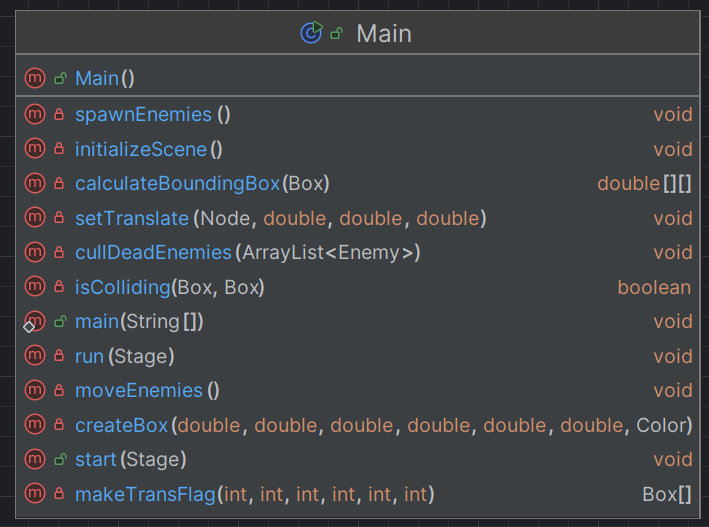
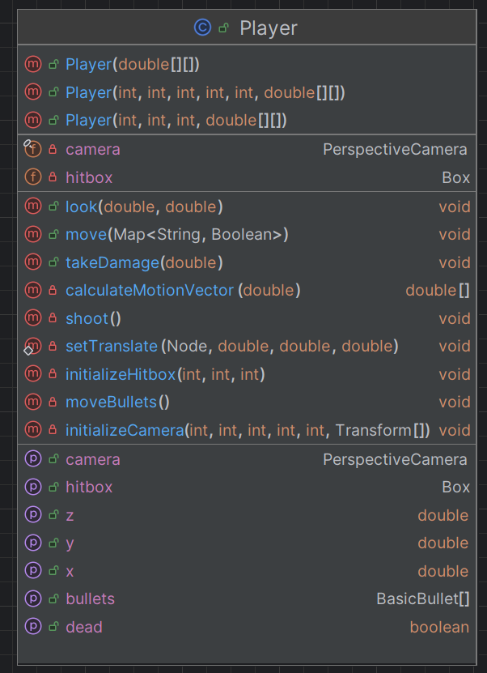
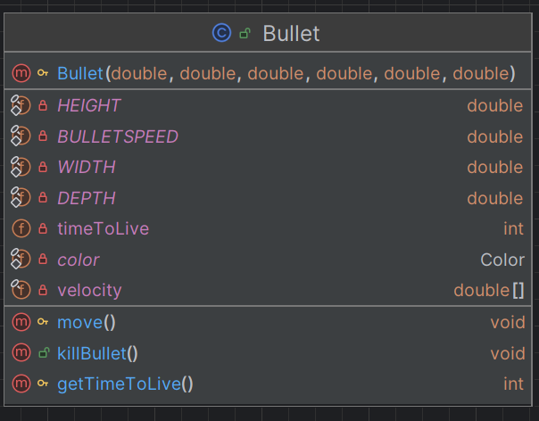

# Java 3D Shooter Game
### Created by: *Braedyn (Violet) French*
___
## How does the camera movement work?
___
### The camera uses trigonometry executed on the x & z axis to determine a vector of motion based on the x-tilt angle of the camera
### This vector of motion allows us to determine how much the camera should move along each axis allowing for movement controls to be relative to the camera's direction
### This motion vector is defined by <x, z> = <SPEED * sin(xTilt.getAngle()), SPEED * cos(xTilt.getAngle())>
### Usually motion vectors are defined as x = cos(angle) but because we are attempting trigonometry on the x and z axis the trigonometry changes
### We can determine that the z-axis associates with cos since at angle=0 the camera is facing the positive z-axis so we use a trig function for the z-axis that has f(0) = 1 which turns out to be cos()
#
### We use this same logic for determing the bullet's motion vector except we also include the y-tilt just for determining the y-velocity
### This is because the bullet is traversing all three axis, and it's movement is based on the angle of the camera
### The logic is the same but the trig changes a little bit since we need to use a different angle to determine the y part of the motion vector
### The y part uses basic trig for the most part but using the y-tilt angle instead of the x-tilt angle.
### The y portion of the vector needs negation however since the y value increases as you go down because of how programs typically render the y-axis
___
## Class Breakdown
___
## Main
### The Main class serves as the driver code for the program and handles instantiation of the 3D environment as well as it's child nodes
### The class also handles the basic gameloop through an AnimationTimer which pulses at a rate of 60hz meaning the game's physics are updated at a rate of 60FPS
### The AnimationTimer is at the center of the game as it is what drives the physics
#
### The Main class also handles hit collision by checking the bounding boxes of different nodes to see if they overlap
#
### The different nodes created are all held within "Group root" in the Main class which is then passed to the scene to create the environment
### All new nodes are to be pushed to root to allow it to be rendered on stage

___
## Player
### The Player class handles parsing of controls into movement of the player and the scene camera
### The movement controls adjust according to the angle of the camera to ensure that the controls always move relative to the camera
### For information on the math behind it view the section titled "How does the camera movement work?"
#
### The Player is an extension of the JavaFX Group class which stores nodes
### This allows us to push any child nodes such as the hitbox or bullets to the Player class and push that to the root Group of the Main class
### The player does have a hitbox within its children which is setVisible(false) which is used for collision calculations or debugging
### While the box could be visible without the user noticing it (since nodes that are clipping into the camera are not rendered) it's best practice to just make it invisible
#
### The Player class also handles the projectiles shot by the player in the projectiles ArrayList
### The projectiles in the ArrayList get displayed in projectilesGroup which is a Group that contains all the currently living bullets
### Every bullet has a timeToLive variable that affects how many movement frames it will exist for
### This is done to prevent lag from too many projectiles or a crash from a projectile going beyond the value's capable of being held by a double
### In addition to a TTL for each bullet they also have a cooldown for the Player between shots
### The SHOTCOOLDOWN defines how many frames must pass between player shots
### For more information on Bullets view the class breakdown for the Bullet Class
#
### The Player has a set speed which serves as a magnitude for the vector of motion (which is based on the camera angle)
### The speed can thus be likened to speed in physics where speed is a directionless magnitude for one's movement and velocity is directional
#
### Every frame (as defined by the AnimationTimer) the Player class executes it's move() method
### This method updates the player's position according to the keys currently held
### It also updates the camera's angle of tilt and the positions of all living bullets (culling any bullets whose TTL has expired)
### Note that the camera's yTilt angle is bounded to [-90°, 90°] to prent turning the camera all the way around
### This allows more realistic camera movement that isn't disorienting when the player looks too far up.
#

___
## Bullet
### The Bullet class serves to carefully bundle together relevant information for a projectile
### Bullet extends Box so it can easily be added to a Group and displayed on scene which is all done by the player class
### Player has an ArrayList of Bullets that are added to a group then pushed to the scene that way Main doesn't need to focus on handling projectile logic
#
### When a bullet is created it receives a position and velocity vector based on the spherical coordinate system so it knows where it starts and what direction it goes in
### This is all calculated in the Player class so that the bullet can remain very nodal by nature
#
### The move() method updates the bullets position by its velocities and then decreases it's remaining timeToLive by one
### timeToLive is the number of frames the bullet will exist for before the Player class will kill it
### The getTimeToLive() function allows the player class to access the TTL and cull bullets whose TTL has expired
### The killBullet() function immediately sets the bullet's TTL to 0 which can be used to kill a bullet early when it hits something
#
### The bullet takes in a base velocity on initialization which is then multiplied by the BULLETSPEED to create the finalized velocity vector for the bullet

___
## Enemy
### The Enemy class represents a single enemy within the system
[Diagram of the Enemy Class](resources/EnemyDiagram.png)

